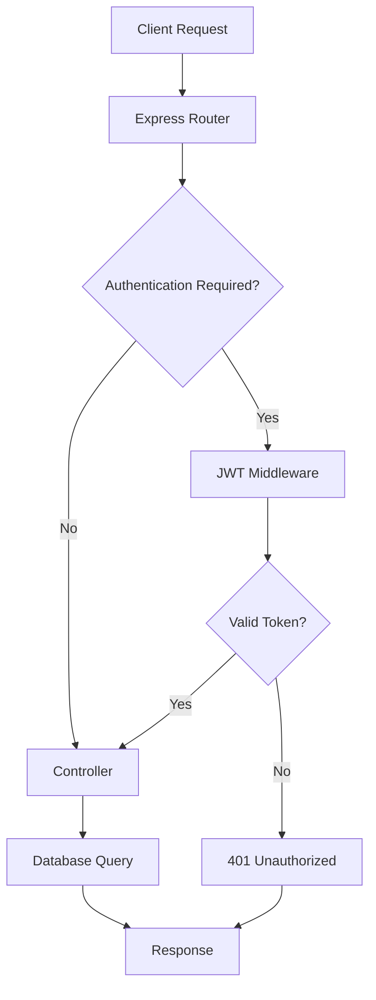

# 📇 Contact Management System

> A comprehensive RESTful API for managing contacts with secure user authentication, built with modern Node.js technologies.


---
This project is deployed on **Render**.
https://contact-management-system-hgsl.onrender.com
## 🎯 Project Overview

This Contact Management System is a backend API that provides secure contact management capabilities with user authentication. It's designed with a clean architecture that separates concerns and follows RESTful principles.

### 🌟 Key Features

- **🔐 Secure Authentication**: JWT-based user authentication with bcrypt password hashing
- **📇 Contact Management**: Full CRUD operations for contacts with user-specific data isolation
- **🛡️ Protected Routes**: Middleware-based route protection ensuring data security
- **🗄️ Database Integration**: MongoDB with Mongoose ODM for robust data management
- **⚡ Performance**: Async/await patterns with proper error handling
- **🏗️ Clean Architecture**: Modular structure with separation of concerns

---

## 🏗️ System Architecture

### Core Components

```
┌─────────────────┐    ┌─────────────────┐    ┌─────────────────┐
│   Client App    │───▶│   Express API   │───▶│   MongoDB       │
│   (Frontend)    │    │   (Backend)     │    │   (Database)    │
└─────────────────┘    └─────────────────┘    └─────────────────┘
                              │
                              ▼
                       ┌─────────────────┐
                       │   JWT Auth      │
                       │   Middleware    │
                       └─────────────────┘
```

### 📁 Project Structure

```
Contact-Management-System/
├── 📁 config/
│   └── 🔧 dbConnection.js          # Database connection setup
├── 📁 controllers/
│   ├── 🎮 contactController.js     # Contact business logic
│   └── 👤 userController.js        # User authentication logic
├── 📁 middleware/
│   ├── ⚠️ errorHandler.js          # Global error handling
│   └── 🛡️ validateTokenHandler.js  # JWT validation middleware
├── 📁 models/
│   ├── 📇 contactModel.js          # Contact data schema
│   └── 👥 userModel.js             # User data schema
├── 📁 routes/
│   ├── 🛣️ contactRoutes.js         # Contact API endpoints
│   └── 🚏 userRoutes.js            # User API endpoints
├── 🔐 .env                         # Environment variables
├── 📦 package.json                 # Dependencies & scripts
└── 🚀 server.js                    # Application entry point
```

---

## 🔄 Request Flow



---

## 🚀 Quick Start

### Prerequisites

- **Node.js** (v14 or higher)
- **MongoDB** (local or cloud instance)
- **npm** or **yarn**

### Installation

1. **Clone the repository**
   ```bash
   git clone https://github.com/utsav31703/Contact-Management-System.git
   cd Contact-Management-System
   ```

2. **Install dependencies**
   ```bash
   npm install
   ```

3. **Environment Setup**
   
   Create a `.env` file in the root directory:
   ```env
   PORT=5000
   MONGO_URI=mongodb://localhost:27017/contact-management
   ACCESS_TOKEN_SECRET=your-super-secret-jwt-key
   ```

4. **Start the server**
   ```bash
   # Development mode
   npm run dev
   
   # Production mode
   npm start
   ```

5. **Verify installation**
   ```bash
   curl http://localhost:5000/api/users/current
   ```

---

## 📋 API Documentation

### 🔐 Authentication Endpoints

| Method | Endpoint | Description | Auth Required |
|--------|----------|-------------|---------------|
| `POST` | `/api/users/register` | Register new user | ❌ |
| `POST` | `/api/users/login` | Login user | ❌ |
| `GET` | `/api/users/current` | Get current user info | ✅ |

### 📇 Contact Endpoints

| Method | Endpoint | Description | Auth Required |
|--------|----------|-------------|---------------|
| `GET` | `/api/contacts` | Get all user contacts | ✅ |
| `POST` | `/api/contacts` | Create new contact | ✅ |
| `GET` | `/api/contacts/:id` | Get specific contact | ✅ |
| `PUT` | `/api/contacts/:id` | Update contact | ✅ |
| `DELETE` | `/api/contacts/:id` | Delete contact | ✅ |

### 📝 Request/Response Examples

#### Register User
```javascript
// POST /api/users/register
{
  "username": "johndoe",
  "email": "john@example.com",
  "password": "securepassword123"
}

// Response
{
  "id": "64a7b8c9d1e2f3a4b5c6d7e8",
  "email": "john@example.com"
}
```

#### Create Contact
```javascript
// POST /api/contacts
// Headers: Authorization: Bearer <jwt-token>
{
  "name": "Jane Smith",
  "email": "jane@example.com",
  "phone": "+1234567890"
}

// Response
{
  "id": "64a7b8c9d1e2f3a4b5c6d7e9",
  "name": "Jane Smith",
  "email": "jane@example.com",
  "phone": "+1234567890",
  "user_id": "64a7b8c9d1e2f3a4b5c6d7e8"
}
```

---

## 🛠️ Technology Stack

### Backend Technologies
- **Node.js** - Runtime environment
- **Express.js** - Web framework
- **MongoDB** - NoSQL database
- **Mongoose** - MongoDB object modeling

### Security & Authentication
- **JWT** - JSON Web Tokens for authentication
- **Bcrypt** - Password hashing
- **dotenv** - Environment variable management

### Development Tools
- **express-async-handler** - Async error handling
- **Nodemon** - Development server auto-restart

---

## 🔧 Configuration

### Environment Variables

| Variable | Description | Example |
|----------|-------------|---------|
| `PORT` | Server port | `5000` |
| `MONGO_URI` | MongoDB connection string | `mongodb://localhost:27017/contacts` |
| `ACCESS_TOKEN_SECRET` | JWT secret key | `your-secret-key` |

### Database Models

#### User Model
```javascript
{
  username: { type: String, required: true, unique: true },
  email: { type: String, required: true, unique: true },
  password: { type: String, required: true }
}
```

#### Contact Model
```javascript
{
  user_id: { type: mongoose.Schema.Types.ObjectId, ref: "User" },
  name: { type: String, required: true },
  email: { type: String, required: true },
  phone: { type: String, required: true }
}
```

---

## 🧪 Testing

### Manual Testing with cURL

```bash
# Register a new user
curl -X POST http://localhost:5000/api/users/register \
  -H "Content-Type: application/json" \
  -d '{"username":"testuser","email":"test@example.com","password":"test123"}'

# Login
curl -X POST http://localhost:5000/api/users/login \
  -H "Content-Type: application/json" \
  -d '{"email":"test@example.com","password":"test123"}'

# Create a contact (use token from login response)
curl -X POST http://localhost:5000/api/contacts \
  -H "Content-Type: application/json" \
  -H "Authorization: Bearer YOUR_JWT_TOKEN" \
  -d '{"name":"John Doe","email":"john@example.com","phone":"123-456-7890"}'
```

### Using Postman
1. Import the API endpoints into Postman
2. Set up environment variables for base URL and token
3. Test the authentication flow and CRUD operations

---

## 🚀 Deployment

### Local Development
```bash
npm run dev
```

### Production Build
```bash
npm start
```

### Docker (Optional)
```dockerfile
FROM node:16-alpine
WORKDIR /app
COPY package*.json ./
RUN npm install
COPY . .
EXPOSE 5000
CMD ["npm", "start"]
```

---

## 🤝 Contributing

1. Fork the repository
2. Create a feature branch (`git checkout -b feature/amazing-feature`)
3. Commit your changes (`git commit -m 'Add some amazing feature'`)
4. Push to the branch (`git push origin feature/amazing-feature`)
5. Open a Pull Request

---

## 📄 License

This project is licensed under the MIT License - see the [LICENSE](LICENSE) file for details.

---

## 👨‍💻 Author

**Utsav Kushwaha**
- GitHub: [@utsav31703](https://github.com/utsav31703)
- LinkedIn: [Connect with me](https://linkedin.com/in/utsav31703)

---

## 🔮 Future Enhancements

- [ ] **Frontend Integration** - React/Vue.js client application
- [ ] **Email Verification** - User email confirmation
- [ ] **Password Reset** - Forgot password functionality
- [ ] **Contact Groups** - Organize contacts into groups
- [ ] **Search & Filter** - Advanced contact search capabilities
- [ ] **Profile Pictures** - Avatar upload for contacts
- [ ] **API Rate Limiting** - Prevent abuse with rate limiting
- [ ] **API Documentation** - Swagger/OpenAPI documentation
- [ ] **Unit Tests** - Comprehensive test coverage
- [ ] **Docker Support** - Container deployment ready

---

## 📞 Support

If you have any questions or run into issues, please:
1. Check the [Issues](https://github.com/utsav31703/Contact-Management-System/issues) page
2. Create a new issue if needed
3. Contact me via GitHub

---

<div align="center">
  <p>Made with ❤️ by Utsav Kushwaha</p>
  <p>⭐ Star this repository if you found it helpful!</p>
</div>
